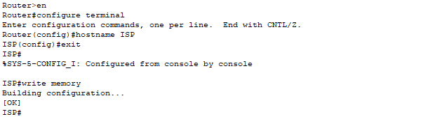

# **3 - Základní síťová konfigurace**

## 3.1 - Úvod

V této kapitole se nastavuje **hostname** všem síťovým prvkům (**routery, switche, servery**), aby byla konfigurace přehledná. Dále se konfigurují **IP adresy** na fyzických portech routerů podle adresního plánu, čímž vzniká základní konektivita mezi **R1, R2, R3 a ISP**. Tento krok je nezbytný pro následné nasazení protokolu **OSPF**, který zajišťuje dynamické sdílení tras mezi routery.

**Statické IP adresy** se přidělují pouze serverům a administrátorskému PC ve **VLAN 10** a tiskárně, ostatní zařízení jsou obsluhována prostřednictvím **DHCP**.

## 3.2 - Pojmenování zařízení

V této části se nastavují názvy (hostname) všem síťovým zařízením, která mají přístup do konzole CLI. Tím se zajišťuje lepší orientace v síti a pozdější konfigurace i práce v prostředí CLI je přehlednější.

|Zařízení|Hostname|
|---|---|
|ISP Router|ISP|
|Router R1|R1|
|Router R2|R2|
|Router R3|R3|
|Switch SW1|SW1|
|Switch SW2|SW2|


### ISP Router

- Hostname: `ISP`

**Konfigurace v CLI:**

```
enable
configure terminal
hostname ISP
exit
write memory
```


### Router R1

- Hostname: `R1`
    

**Konfigurace v CLI:**

```
enable
configure terminal
hostname R1
exit
write memory
```


### Router R2

- Hostname: `R2`
    

**Konfigurace v CLI:**

```
enable
configure terminal
hostname R2
exit
write memory
```


### Router R3

- Hostname: `R3`
    

**Konfigurace v CLI:**

```
enable
configure terminal
hostname R3
exit
write memory
```


### Switch SW1

- Hostname: `SW1`
    

**Konfigurace v CLI:**

```
enable
configure terminal
hostname SW1
exit
write memory
```


### Switch SW2

- Hostname: `SW2`
    

**Konfigurace v CLI:**

```
enable
configure terminal
hostname SW2
exit
write memory
```


### Závěr

Každé zařízení, které má přístup do konzole CLI, získává jednoznačný název. Tím se zajišťuje přehlednost konfigurace a usnadňuje se práce při správě sítě. Nastavený hostname se ukládá do běžící i startovací konfigurace a zůstává zachován i po restartu zařízení.

## 3.3 - Nastavení IP adres na portech routerů


### ISP Router

- Port: `GigabitEthernet0/0` (spojení směrem na R1)
    
- IP adresa: `100.64.5.1 255.255.255.252`
    

**Konfigurace v CLI:**

```
enable
configure terminal
interface GigabitEthernet0/0
ip address 100.64.5.1 255.255.255.252
no shutdown
exit
end
write memory
```


### Router R1

- Port: `GigabitEthernet0/1` (spojení směrem na ISP)
    
- IP adresa: `100.64.5.2 255.255.255.252`
    
- Port: `GigabitEthernet0/2` (spojení směrem na R2)
    
- IP adresa: `10.31.0.1 255.255.255.252`
    

**Konfigurace v CLI:**

```
enable
configure terminal
interface GigabitEthernet0/1
ip address 100.64.5.2 255.255.255.252
no shutdown
exit
interface GigabitEthernet0/2
ip address 10.31.0.1 255.255.255.252
no shutdown
exit
end
write memory
```


### Router R2

- Port: `GigabitEthernet0/0` (spojení směrem na R1)
    
- IP adresa: `10.31.0.2 255.255.255.252`
    
- Port: `GigabitEthernet0/1` (spojení směrem na SW1, trunk pro VLAN 10,20,30,40,50)
    
- IP adresa: nenastavuje se
    
- Port: `GigabitEthernet0/2` (spojení směrem na R3)
    
- IP adresa: `10.31.1.1 255.255.255.252`
    

**Konfigurace v CLI:**

```
enable
configure terminal
interface GigabitEthernet0/0
ip address 10.31.0.2 255.255.255.252
no shutdown
exit
interface GigabitEthernet0/1
no ip address
no shutdown
exit
interface GigabitEthernet0/2
ip address 10.31.1.1 255.255.255.252
no shutdown
exit
end
write memory
```


### Router R3

- Port: `GigabitEthernet0/1` (spojení směrem na R2)
    
- IP adresa: `10.31.1.2 255.255.255.252`
    
- Port: `GigabitEthernet0/2` (spojení směrem na SW2, trunk pro VLAN 60,70)
    
- IP adresa: nenastavuje se
    

**Konfigurace v CLI:**

```
enable
configure terminal
interface GigabitEthernet0/1
ip address 10.31.1.2 255.255.255.252
no shutdown
exit
interface GigabitEthernet0/2
no ip address
no shutdown
exit
end
write memory
```


### Závěr

Na routerech se nastavují IP adresy pouze na portech tvořících páteřní propojení, čímž se umožní přímá komunikace mezi sousedními zařízeními. Porty směrem ke switchům zůstávají bez adresy, protože budou později využity pro trunky a subrozhraní VLAN. Toto nastavení tvoří základ pro následné směrování pomocí OSPF.


## 3.4 - OSPF

Tady se na routerech aktivuje dynamické směrování pomocí protokolu OSPF. 
OSPF umožňuje, aby si routery automaticky vyměňovaly informace o připojených sítích a dokázaly směrovat pakety nejen ke svým přímým sousedům, ale i do vzdálenějších částí topologie. 
V této fázi se do OSPF přidávají pouze páteřní point-to-point linky mezi routery, aby byla propojena základní síťová kostra.

VLANy a jejich IP podsítě se doplní do OSPF až později po vytvoření subrozhraní/trunk.

### ISP Router - OSPF

- Do OSPF se přidává síť `100.64.5.0/30` na rozhraní směrem k R1.
    
- Díky tomu ISP navazuje sousedství s R1 a propaguje dostupnost své sítě do celé topologie.
    

**Konfigurace v CLI:**

```
enable
configure terminal
router ospf 1
network 100.64.5.0 0.0.0.3 area 0
exit
end
write memory
```


>**Pozn.:** V Packet Traceru je nutné zapnout OSPF i na ISP routeru, aby byla simulace plně funkční. V reálné síti by se na zařízeních poskytovatele OSPF obvykle nenastavoval – klient využívá pouze defaultní bránu.


### Router R1 - OSPF

- Do OSPF se přidává síť `100.64.5.0/30` směrem k ISP.
    
- Do OSPF se přidává síť `10.31.0.0/30` směrem k R2.
    

**Konfigurace v CLI:**

```
enable
configure terminal
router ospf 1
network 100.64.5.0 0.0.0.3 area 0
network 10.31.0.0 0.0.0.3 area 0
exit
end
write memory
```


### Router R2 - OSPF

- Do OSPF se přidává síť `10.31.0.0/30` směrem k R1.
    
- Do OSPF se přidává síť `10.31.1.0/30` směrem k R3.
    

**Konfigurace v CLI:**

```
enable
configure terminal
router ospf 1
network 10.31.0.0 0.0.0.3 area 0
network 10.31.1.0 0.0.0.3 area 0
exit
write memory
```


### Router R3 – OSPF

- Do OSPF se přidává síť `10.31.1.0/30` směrem k R2.
    
- Díky tomu R3 navazuje sousedství s R2 a tranzitní síť mezi routery je propojena od ISP až po R3.
    

**Konfigurace v CLI:**

```
enable
configure terminal
router ospf 1
network 10.31.1.0 0.0.0.3 area 0
exit
write memory
```


### Závěr 

Po nastavení OSPF na všech routerech (ISP, R1, R2, R3) je vytvořena základní směrovací kostra. Routery si dynamicky vyměňují informace o připojených sítích a zajišťují plnou konektivitu mezi všemi body topologie. 

**Úspěšný test pomocí příkazu `ping` z R3 směrem k ISP (5/5 bez ztráty) potvrzuje správnou funkci směrování.**


## 3.5 - Shrnutí

V kapitole se nastavují hostname zařízení s přístupem do CLI a konfigurují se IP adresy na páteřních P2P rozhraních. Porty ke switchům zůstávají bez IP kvůli trunkům a budoucím subrozhraním a aktivuje se OSPF v area 0 s wildmaskami na páteřních linkách.

Pro účely simulace je OSPF zapnut i na ISP. **Funkčnost je potvrzena pingem z R3 na ISP (5/5 bez ztráty).**

**Pokračovat na další kapitolu: vlany subinterfaces.**


